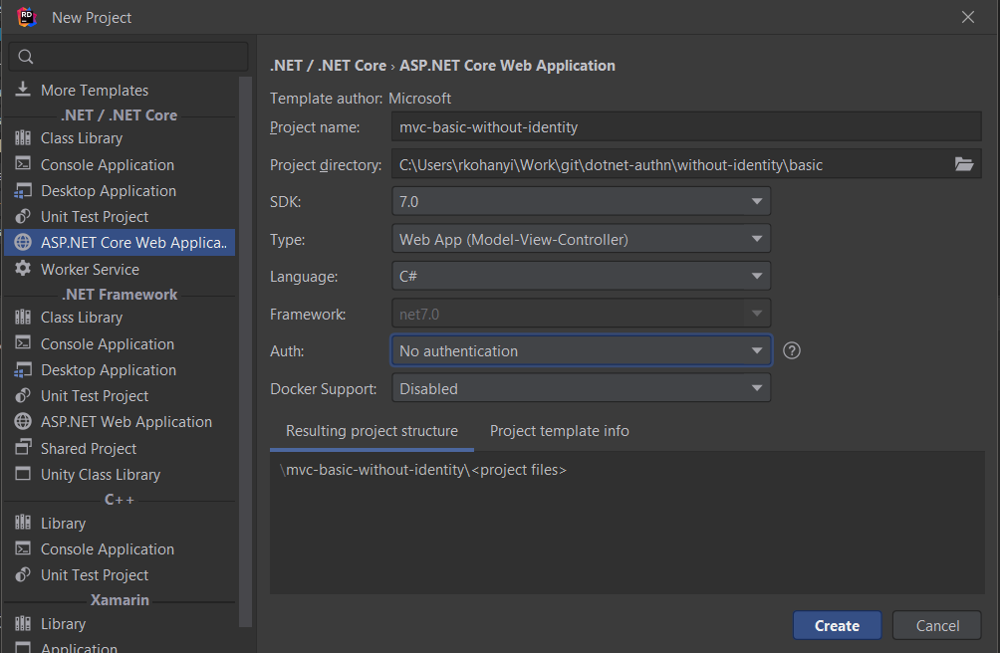

# MVC + Basic Auth w/o Identity

## Points of Interest

- Regular MVC app
- It contains `wwwroot` that contains static assets, Bootstrap files, etc.
- Created a `_/Home/UserSecret_` and `_/Home/AdminSecret_` view and [put `\[Authorize\]` on it](https://learn.microsoft.com/en-us/aspnet/core/security/authorization/simple?view=aspnetcore-7.0) (requiring “Admin” role on the latter)
- Also created endpoints to serve these views in [`HomeController`](../Controllers/HomeController.cs)
- Without authentication in place there’s a _big ass_ error page
- After adding authentication (the custom basic authentication handler) stuff “works”
- Mind the request [path testing at the beginning of the custom authentication handler implementation](../Services/BasicAuthenticationHandler.cs)
    - This could have done via [checking for the _AllowAnonymous_ attribute](https://stackoverflow.com/questions/68070198/net-core-web-api-api-key-authentication-allowanonymous) too at runtime
- The same thing could be [handled with a filter](https://learn.microsoft.com/en-us/aspnet/core/mvc/controllers/filters?view=aspnetcore-7.0#filter-scopes-and-order-of-execution) - it seems unnecessarily complicated 😟

