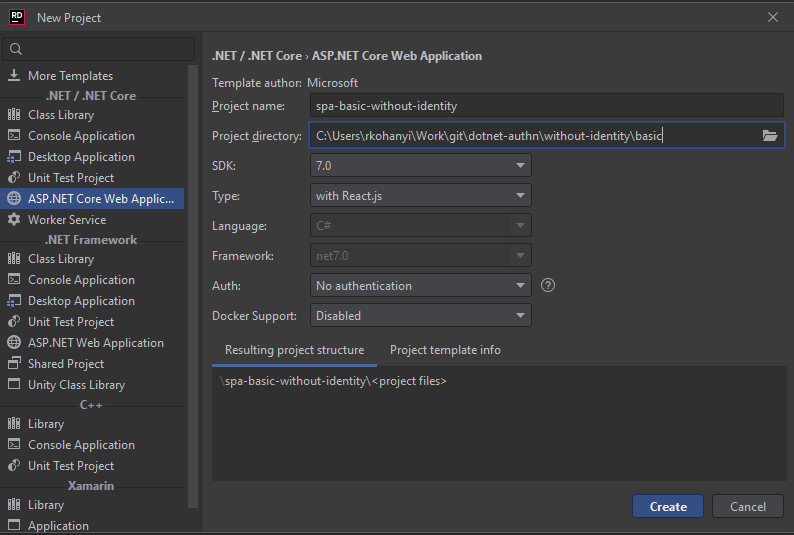

# SPA + Basic Auth w/o Identity

## Points of Interest

- Basic authentication with React frontend and Web API backend project
- The built-in template [uses SpaProxy](https://learn.microsoft.com/en-us/aspnet/core/client-side/spa/intro?view=aspnetcore-7.0), which is a fancy Microsoft “thingy” that hides some crucial configuration options from developers (for ease of use) such as
    - [Using HTTPS and a self-signed certificate](https://create-react-app.dev/docs/using-https-in-development/) for development
    - [Proxying](https://create-react-app.dev/docs/proxying-api-requests-in-development/) requests between frontend and backend (the template uses setupProxy for its fancy “magic”)
- setupProxy.js must be updated to pass requests to the backend other than the one used in by the project template
- The server-side must be implemented in a way so that it respects the “X-Requested-With: XMLHttpRequest” header in order _not_ to send back the WWW-Authenticate header in the HTTP response when requesting a resource that requires basic authentication, otherwise the “usual” login window seen in browsers would popup even when doing a background fetch - usually webservers respect this, but since the authentication stuff is custom this needs to be accounted for
- The login functionality here is clearly _craptastic_, it saves the username and password to localStorage which is super insecure, even sessionStorage would be insecure so this whole scenario is just a demo nothing more
- `app.UseAuthorization()` must be configured in `Program.cs` as it is not done by default

