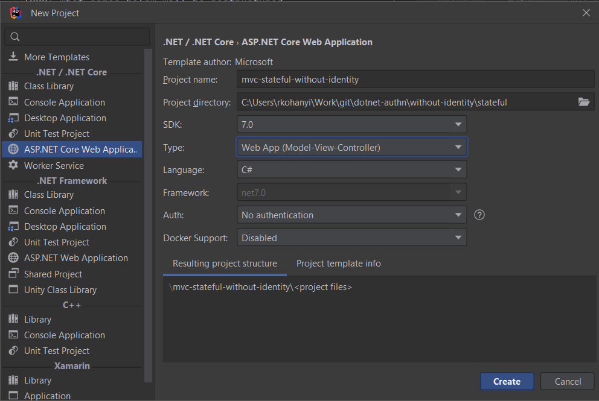

# MVC + ~~Cookie~~ ~~Session~~ Stateful(?) Auth w/o Identity

## Points of Interest

1. Regular MVC app just like [`mvc-basic-without-identity`](../../../basic/mvc-basic-without-identity/README.md)
2. This time instead of basic authentication uses cookie-based authentication, [based on this tutorial](https://learn.microsoft.com/en-us/aspnet/core/security/authentication/cookie?view=aspnetcore-7.0)
    1. Since [ASP.NET Core 7](https://en.wikipedia.org/wiki/ASP.NET_Core) (I'm not sure whether .NET and ASP.NET Core is
       versioned _together_ or not) there's no need to specify _CookieAuthenticationDefaults_ for the first call to
       _AddAuthentication_, if there's only one auth scheme registered it'll be the default
1. Only the Login page is implemented, the following are _not_
    1. Proper handling of _ReturnUrl_ - redirect always to the _Home_ page on success
    2. When access is denied (user accessing admin content) there's a 404 page instead
    3. Logout is handled with GET, but should be POST instead in an ideal scenario - also the logout link is always
       visible

