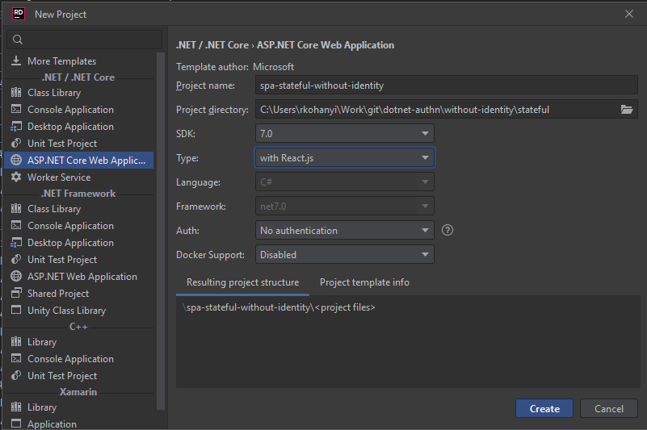

# API + React + ~~Cookie~~ ~~Session~~ Stateful(?) Auth w/o Identity

## Points of Interest

1. Same as _WebApplication3_ just with _AddCookie_ (or the same as the previous _WebApplication5_ with React)
2. The _Login_ component now _does_ login not as with the previous example
3. _setupProxy_ again needs to be modified
4. Using _AddCookie_ results in _weird_ 302 redirects when accessing a protected route, which can be handled in React, but it's still weird (can be "ignored" and disable with a flag)
    - .NET 8 preview comes with new stuff for ASP.NET Core as well, [**for example better SPA integration when using _Identity_**](https://github.com/dotnet/aspnetcore/pull/47927) (this scenario is about _not_ using Identity at all, but I wager the "minimal API" version of the SPA templates available in _dotnet new_ will leverage some of this)
5. _Logout is not implemented (restart the server)_
6. After a successful login there's nothing to do, cookies are sent with every request
7. In same-site scenarios this works as expected, but things break down when cross-site requests come into picture, the example doesn't deal with this (generally things break in cross-site request scenarios 😁)

